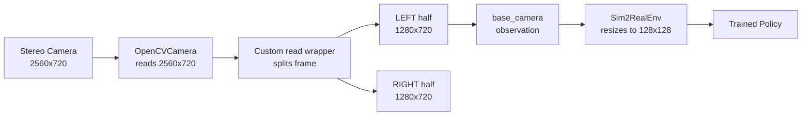

# Single Camera Selection from Stereo Stream

## First Principles Analysis

**Your Hardware**: Stereo camera outputting 2560x720 MJPG (two 1280x720 views side-by-side)**Your Current Error**:

```javascript
RuntimeError: OpenCVCamera(0) failed to set capture_height=480 (actual_height=240, height_success=True)
```

Caused by config mismatch: requesting 640x480 but camera hardware provides different resolution.---

## Why "Wider FOV" Was Wrong

You are correct. Two cameras side-by-side provide **two different viewpoints**, not a wider field of view. Feeding a concatenated 2560x720 image to a policy trained on 128x128 would fail because:

1. The policy CNN was trained to recognize features from ONE specific camera viewpoint
2. The calibration aligns ONE simulated camera pose to ONE real camera pose
3. Concatenated images would have discontinuities and duplicate objects at different positions

---

## The Hard Constraints (with sources)

### Constraint 1: Sim environment has ONE camera named "base_camera"

**Source**: [`lerobot_sim2real/scripts/camera_alignment.py` lines 191-193](lerobot_sim2real/scripts/camera_alignment.py)

```python
sim_env.unwrapped.camera_mount.set_pose(pose)
sim_env.unwrapped._sensors["base_camera"].camera.set_fovy(
    sim_env.unwrapped.base_camera_settings["fov"] + fov_offset
)
```


### Constraint 2: Real and sim camera names MUST match exactly

**Source**: [`lerobot_sim2real/scripts/camera_alignment.py` lines 100-102](lerobot_sim2real/scripts/camera_alignment.py)

```python
assert sorted(real_obs.keys()) == sorted(
    sim_obs.keys()
), f"real camera names {real_obs.keys()} and sim camera names {sim_obs.keys()} differ"
```


### Constraint 3: EasyHEC calibration works on ONE camera at a time

**Source**: [`simple-easyhec/easyhec/examples/real/so100.py` lines 312-314](simple-easyhec/easyhec/examples/real/so100.py)

```python
for k in initial_extrinsic_guesses.keys():
    print(f"Calibrating camera {k}")
    initial_extrinsic_guess = initial_extrinsic_guesses[k]
```

It saves ONE extrinsic matrix per camera to `camera_extrinsic_ros.npy`.

### Constraint 4: Policy CNN dynamically sizes based on observation shape

**Source**: [`lerobot_sim2real/rl/ppo_rgb.py` lines 196-197](lerobot_sim2real/rl/ppo_rgb.py)

```python
in_channels=sample_obs["rgb"].shape[-1]
image_size=(sample_obs["rgb"].shape[1], sample_obs["rgb"].shape[2])
```

The CNN architecture computes its internal dimensions from the input shape. Training and deployment MUST use same shape.

### Constraint 5: OpenCV camera validates that requested resolution matches actual

**Source**: [`lerobot/lerobot/common/cameras/opencv/camera_opencv.py` lines 237-241](lerobot/lerobot/common/cameras/opencv/camera_opencv.py)

```python
actual_height = int(round(self.videocapture.get(cv2.CAP_PROP_FRAME_HEIGHT)))
if not height_success or self.capture_height != actual_height:
    raise RuntimeError(
        f"{self} failed to set capture_height={self.capture_height} ({actual_height=}, {height_success=})."
    )
```

---

## The Solution: Split Frame, Use ONE Camera



You pick either LEFT or RIGHT camera view. The other is discarded. This gives you:

- ONE viewpoint that matches the sim's single base_camera
- Standard calibration workflow (align that ONE view)
- Policy compatibility (single-camera input)

---

## Implementation Options

### Option A: Split in OpenCVCamera subclass (cleanest)

Create a custom camera class that:

1. Inherits from OpenCVCamera
2. Captures the full 2560x720 frame
3. Returns only the selected half (left or right) from `read()` and `async_read()`

Requires modifying:

- Create new file: `lerobot_sim2real/cameras/stereo_split_camera.py`
- Update: `lerobot_sim2real/config/real_robot.py` to use the new camera class

### Option B: External split before capture (simpler but hacky)

Use v4l2loopback to create a virtual camera device that only shows one half:

```bash
# Create virtual device that shows left half of /dev/video0
ffmpeg -f v4l2 -i /dev/video0 -vf "crop=1280:720:0:0" -f v4l2 /dev/video2
```

Then point OpenCVCamera at `/dev/video2`.Requires: ffmpeg running as background process, v4l2loopback kernel module

### Option C: Patch at robot observation level

Modify `SO100Follower.get_observation()` to split the frame after capture.Requires modifying: `lerobot/lerobot/common/robots/so100_follower/so100_follower.py`

Downside: Modifies LeRobot library code directly---

## Recommended: Option A (Custom Camera Class)

### Step 1: Create StereoSplitCamera

New file `lerobot_sim2real/cameras/stereo_split_camera.py`:

```python
from lerobot.common.cameras.opencv.camera_opencv import OpenCVCamera
from lerobot.common.cameras.opencv.configuration_opencv import OpenCVCameraConfig

class StereoSplitCamera(OpenCVCamera):
    """Wraps OpenCVCamera to capture stereo and return only left or right half."""
    
    def __init__(self, config: OpenCVCameraConfig, side: str = "left"):
        # Adjust config to capture full stereo width
        self.side = side
        self.stereo_width = config.width  # e.g., 2560
        self.single_width = self.stereo_width // 2  # e.g., 1280
        super().__init__(config)
        
    def _postprocess_image(self, image, color_mode=None):
        # Call parent's postprocess for color conversion and rotation
        processed = super()._postprocess_image(image, color_mode)
        # Split: left half is [:, :mid], right half is [:, mid:]
        mid = processed.shape[1] // 2
        if self.side == "left":
            return processed[:, :mid]
        else:
            return processed[:, mid:]
```


### Step 2: Update robot config

Modify `lerobot_sim2real/config/real_robot.py`:

```python
from lerobot_sim2real.cameras.stereo_split_camera import StereoSplitCamera, StereoSplitCameraConfig

# In create_real_robot():
cameras={
    "base_camera": StereoSplitCameraConfig(
        index_or_path=0,
        fps=20,
        width=2560,   # Full stereo width
        height=720,   # Full stereo height  
        side="left"   # Pick left or right
    )
}
```

The camera will:

1. Capture at 2560x720
2. Return only 1280x720 (left or right half)
3. Sim2RealEnv will resize this to 128x128 (or whatever sim uses)

---

## Which Side to Pick?

Look at your camera image. Pick the side that:

1. Has better view of the robot workspace
2. Can see the cube spawn area
3. Has less obstructions

You mentioned you have the image but it couldn't be read. Please describe which side (left/right of the concatenated image) shows a better view of your robot and workspace.---

## Calibration After Fix

Once the camera outputs a single 1280x720 view:

1. **Run camera alignment**:
```bash
python -m lerobot_sim2real.scripts.camera_alignment \
  --env-id="SO100GraspCube-v1" \
  --env-kwargs-json-path=env_config.json
```


2. **Run EasyHEC if needed** (for precise calibration):
```bash
python -m easyhec.examples.real.so100 \
  --opencv-camera-id=0 \
  --camera-intrinsics-path=path/to/intrinsics.json
```


Both work exactly as before because they see ONE camera named "base_camera".---

## Summary

| Aspect | Your Hardware | Required for Sim2Real |

|--------|---------------|----------------------|

| Cameras | 2 (stereo concatenated) | 1 ("base_camera") |

| Resolution | 2560x720 | 1280x720 (after split) |

| Viewpoint | Two different views | Single consistent view |

| Calibration | Would need two | Supports one |